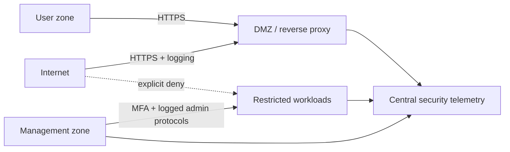

# Network Segmentation Policy Validator

[](https://github.com/nicolasferrerm/network-security-architecture/actions/workflows/ci.yml)

A segmented enterprise reference architecture with a small policy-as-code validator. Architectural decisions are represented as reviewable JSON and tested in CI so unsafe trust relationships cannot be introduced silently.

## Reference design



## Enforced controls

- Required internet, DMZ, user, management, and restricted zones.
- No allowed `any/any` rules.
- No direct internet-to-restricted access.
- MFA and session logging for inbound management access.
- Valid zone references, explicit actions, and no duplicate flows.

## Validate locally

```bash
python -m pip install -e .
network-arch architecture/reference.json
python -m pytest -q
```

An empty JSON array and exit code `0` indicate that the document satisfies the implemented guardrails. This is a reference pattern, not a vendor-specific production firewall configuration; real deployments require threat modeling, availability analysis, and organization-specific change approval.

## Author

Nicolas Ferrer — Information Systems Security student at SAIT, focused on secure architecture, network defense, and security operations.
